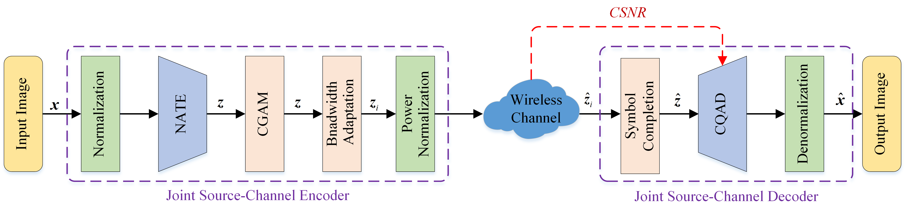

# Dynamic_JSCC

This is the code for paper "High Efficiency Deep Joint Source-Channel Coding for One-to-Many Wireless Image Transmission". The model is implemented with PyTorch.

<div align="center">
  
</div>

<div align="center">
  
</div>

# Usage

```
git clone https://github.com/llsurreal919/MDJSCCpip 

install -r requirements.txt
```

## Dataset

The test dataset can be downloaded from [百度网盘：8888](https://pan.baidu.com/s/1Ki0AuUUsVu4W17eBtpNu6w?pwd=8888) .

The training dataset can be downloaded from [DIV2K](https://data.vision.ee.ethz.ch/cvl/DIV2K/) .

## Training

We will release the tutorial soon.

## Testing

Pre-trained models can be downloaded from [GoogleDrive](https://drive.google.com/file/d/1o7aqd5OgAIltr8NK6tmF-jkeq7xmc1HS/view?usp=sharing).

Example usage:

    python test_dyna_kodak.py

## Acknowledgement

The style of coding is borrowed from [Dynamic_JSCC](https://github.com/mingyuyng/Dynamic_JSCC) and partially built upon the [Neighborhood Attention Transformer](https://github.com/SHI-Labs/Neighborhood-Attention-Transformer). We thank the authors for sharing their codes.

## Contact

If you have any question, please contact me (He Ziyang) via s210131061@stu.cqupt.edu.cn.
